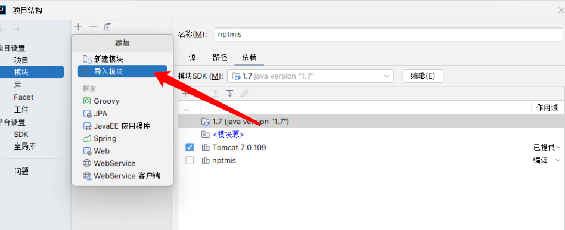
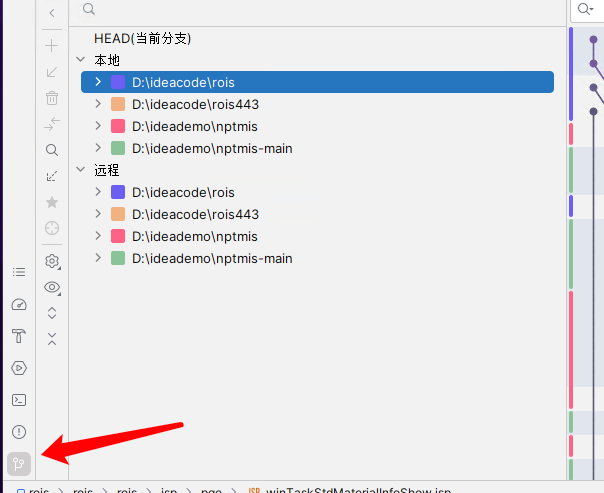

# **IDEA 如何在一个project中运行多个项目**

>
>   ### 注意事项：旧版本IDEA（IntelliJ IDEA 2020.2.2 版本）对多项目GIT操作不友好 建议配合其他git管理工具使用、
> 
> 较新版本已经解决多项目GIT不方便处理的问题了  
> 
> 当前不建议使用2023.1.5以后的版本 因为1.5以后的版本不支持公司自己开发的插件
> 
> 本文档中使用的是 IntelliJ IDEA 2023.1.5 版本进行截图 与

## 1. 创建一个空白项目

省略

## 2. 打开项目结构设置
点击导入模块找到对应的项目点击导入

选择从现有项目创建模块

选择代码源文件，不要选已经编译好的文件

选择对应的库配置 （lib） 请注意 out/artfacts 是idea编译后的输出位置，不要选这个

确认选择的配置，无误后点击下一步

out/artfacts 是idea编译后的输出位置，不要选这个

## 3. 调整配置

处理多余的web配置 （多余的配置是idea自动添加的）

配置对应的工件（翻译过来是这个） tomcat中配置的也是这个

处理工件依赖

在tomcat中进行配置就可以运行了

然后就可以运行了

## 4.git 代码提交

旧版本可以使用 Sourcetree 进行提交 （公司内部比较推荐的git可视化管理工具）

idea 中的操作

